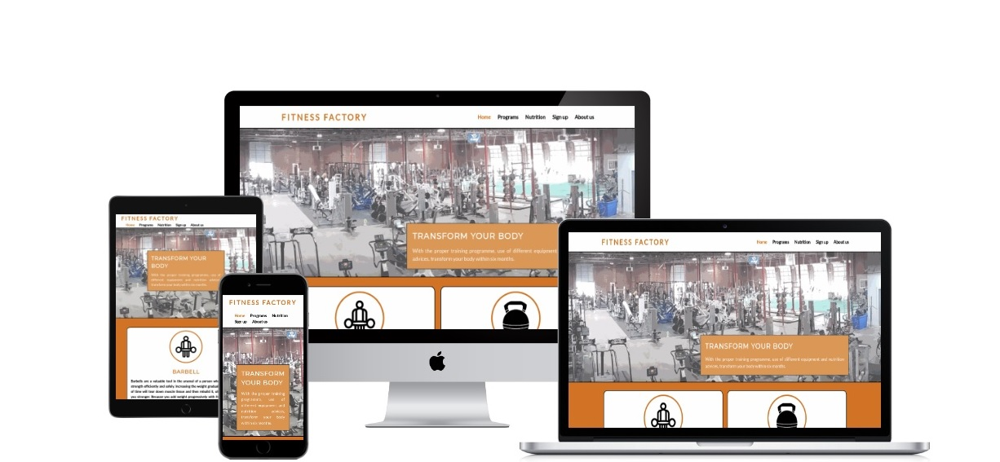
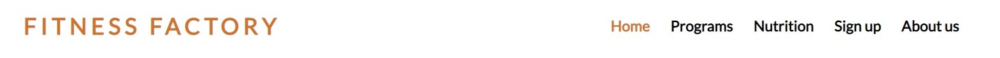
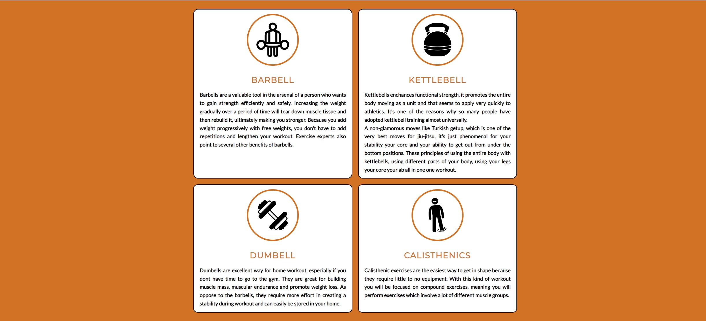
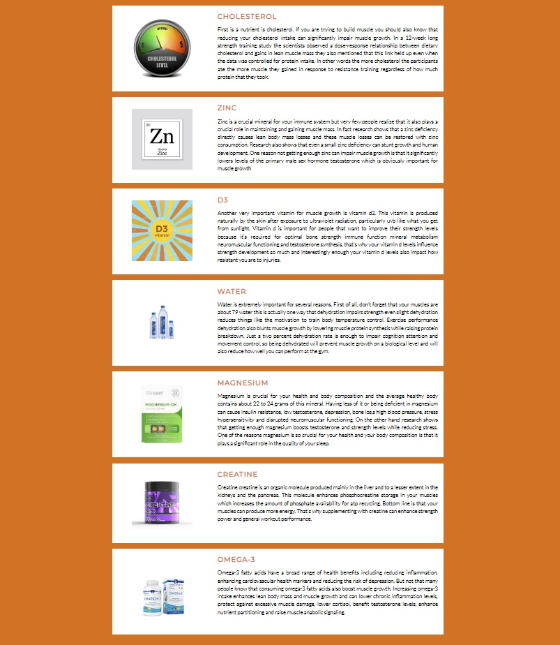
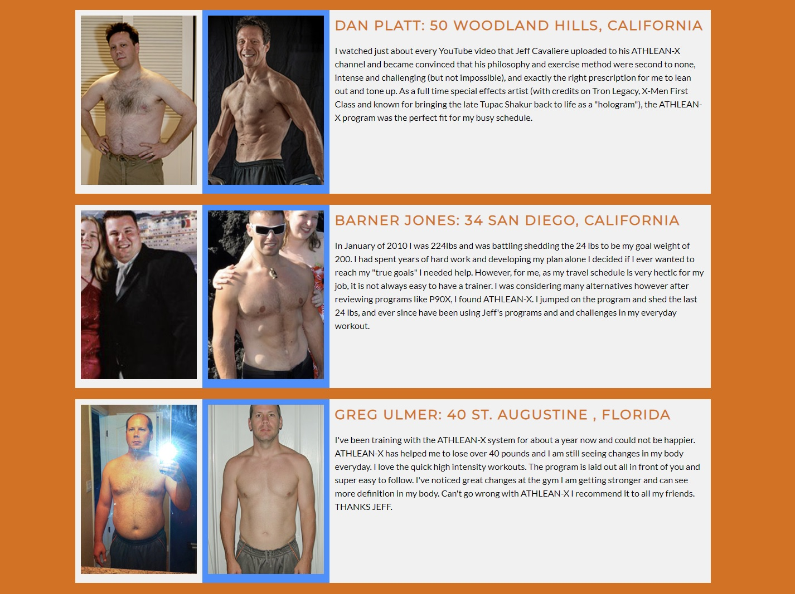
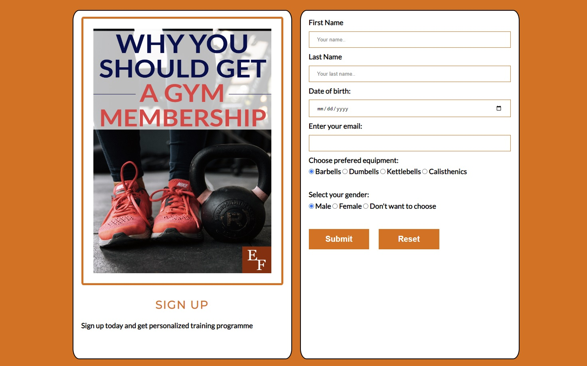

# Fitness Factory

Fitness Factory is a company based in Dublin, Republic of Ireland, with the bussiness of running a large
gym. Website will hold information on not just the gym with the location, but the information 
on fitness in general. We will try to educate our audiance on how to build muscles and lose weight by providing guidance
on training programmes and nutrition required to do so.

## Features

In this section I will provide text and images of different features used. Website consists of navigation bar, different 
equipment to allow users to choose how they want to get fit, a footer with company information and sections on training programme,
nutrition and sign up page with displayed results from our successful customers.

### Existing features

* Navigation bar
  * Placed at the top of all four pages, with the orange color marking the active page displayed. Users can use company logo "Fitness Factory" to
  get to the starting page¸

* Main image on starting page
  * Large image of our gym showing users that we are equipped with huge selection of fitness gear in a large space, along with the banner encouraging our
  customers that we are all they need to start they're jurney.

* Fitness equipment
  * This section will emphasize on different choices on how to get fit and build muscles, including calisthenics, barbells, dumbells and kettlebells.
  * Each part of this section will provide users information on benefits of using different equipment.

* Footer
  * Footer section located at the bottom of all four pages and is split into three parts:
    * Information on our gym with its location, working days and hours along with phone and email contact.
    * Our online shop.
    * Social links representing all main social sites, which will open in a new tab allowing users to return easy to our website.

* Nutrition:
  * Nutrition page is divided into main banner image holding header text emphasising the importance of proper nutrition in order to build muscles
  and images with text describing what are the benefits of using them.

* Sign up:
  * Sign up page consists of two parts:
    * First part is displaying users successful stories of our customers who achieved body transformation they desired, along with images of
    them before and after their fitness journey.

    
    * Second part is a sign up form where customers can add their information and choose which fitness equipment will suit them best, allowing our
    educated trainer to make specific training programmed for them.

    

### Features left to implement
* Training programs
  * Training program page is divided into two parts:
    * First is the main image with the banner displaying header text as an introduction for training programme page.
    * Second is the information on our training programmes including text part including which exercises should be performed for each body part
     and youtube videos on how to perform each exercise.
    
## UX/UI Section

### Site goal

The main goal of Fitness Factory website is to convice users that they can change their body with proper training and nutrition in as little as six
months, providing information on training programme and nutrition required to do so. It's very important that the information and navigation is well 
organized so that users can get all the information they need to convince them to sign up and join us. Coding part should be done well so that new 
administrators can add or change programmes and nutrition part when new science discoveries are made in fitness industry.

### Design choices
In the landing page we want to inform customers about our gym and all the features it provides. Our navigation bar should give basic idea to the users
what they need to achieve their dream body goal.
### User stories

#### As a new or existion customer
* I want to build muscles
* I want to lose weight
* I want to complete the form to get personalized training
* I want to be informed on fitness industry standards
* I want to know what I haven't done so far in my fitness journey

#### As a website administrator
* I want to provide users with information on building muscles
* I want to provide users with information on losing weight
* I want to users to see that we are well informed website
* I want users to sign up on our form
* I want to edit/add new nutrition data upon scientific research published

## Testing
In Testing section we want to test both the technical and the content part. Our website should run flawlessly without any bugs and when users sign up and
provide us with the information, our trainers should get that without any problems so they can create individual training and nutrition plan. Content part 
must give users enough information so they know we well educated and experienced and that we can help them achieve their goals.
### Manual testing
All links were tested and are working properly.

### User stories testing
Some user stories were tested, but website needs programme page to be done.
### Validator testing
Html was tested and no errors were returned when passing through the [w3schools validator](https://validator.w3.org/nu/?doc=https%3A%2F%2Fzoranzoroe.github.io%2Fpp1-fitness-factory%2Findex.html)

CSS was tested and no errors were returned when passing through the [Jigsaw validator](https://jigsaw.w3.org/css-validator/validator?uri=https%3A%2F%2Fzoranzoroe.github.io%2Fpp1-fitness-factory%2Findex.html&profile=css3svg&usermedium=all&warning=1&vextwarning=&lang=en)
## Deployement
Website was deployed at github on link [Fitness Factory](https://zoranzoroe.github.io/pp1-fitness-factory/index.html)
## Credits
### Content
* Instructions how to build flexbox models and forms used on this website was taken from these websites / youtube channels :
  * [w3schools](https://www.w3schools.com/)
  * [Kevin Powell](https://www.youtube.com/kepowob)
  * [Traversy Media](https://www.youtube.com/c/TraversyMedia)
  * [Web Dev Simplified](https://www.youtube.com/c/WebDevSimplified)

* Social icons used in footer were taken from  [Font Awesome](https://fontawesome.com/)
* Icons used in fitness equipment section were taken from [Flat icon](https://www.flaticon.com/)
* Text used in fitness equipment section were taken from [healthyliving](https://healthyliving.azcentral.com/benefits-barbells-5223.html),
[webmd.com](https://www.webmd.com/fitness-exercise/what-to-know-about-dumbbells)
* Text used in fitness equipment was taken from [Joe Rogan Experience](https://www.youtube.com/c/joerogan/)
* Text used in nutrition page was taken from [Gravity Transformation](https://www.youtube.com/user/GravityTrainingSol/)
### Media
* Main image on landing page [Fitness Factory Charlotte](https://www.fitnessfactorycharlotte.com/)
* Images for nutrition page were taken from: [Cafe press](https://www.cafepress.com/+periodic-table-zinc+square-stickers) ,
  [Deposit photos](https://depositphotos.com/),[wallsauces](https://www.wallsauce.com/)
* Images for sign up page were taken from: [Wallpapercave](https://wallpapercave.com/), [everythingfinanceblog](https://everythingfinanceblog.com/23279/gym-membership.html*)

* Video clips for training programme page were taken from [ATHLEAN-X](https://www.youtube.com/c/athleanx/) but will be implemented in future.